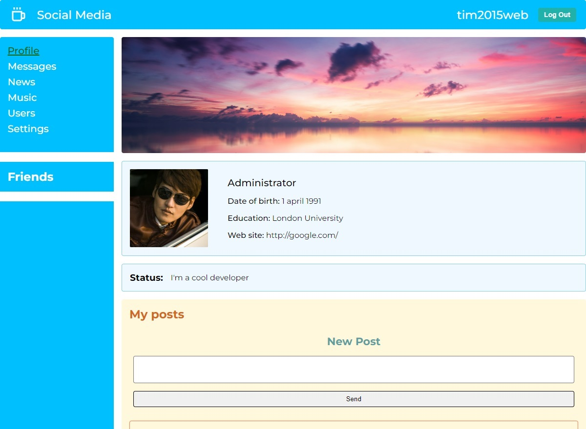
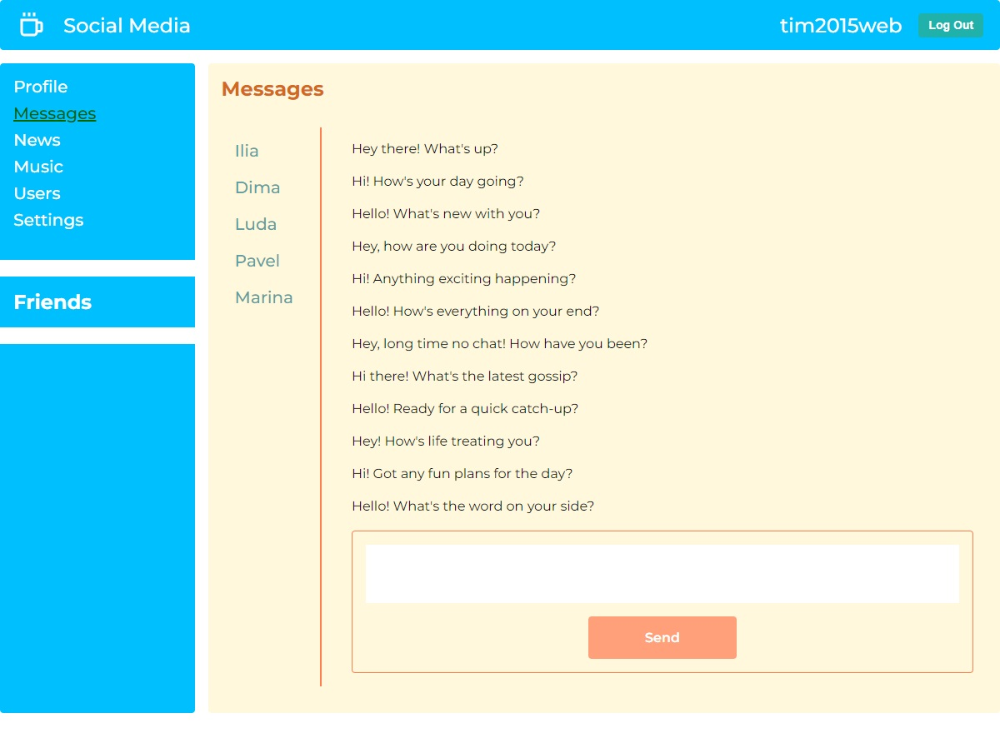
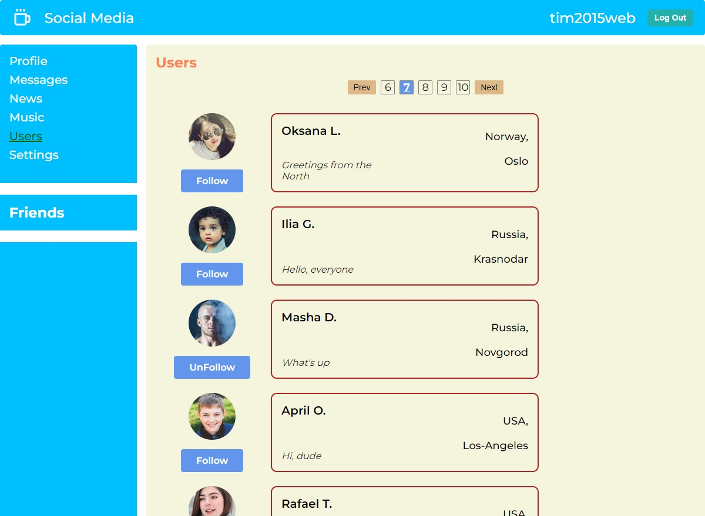
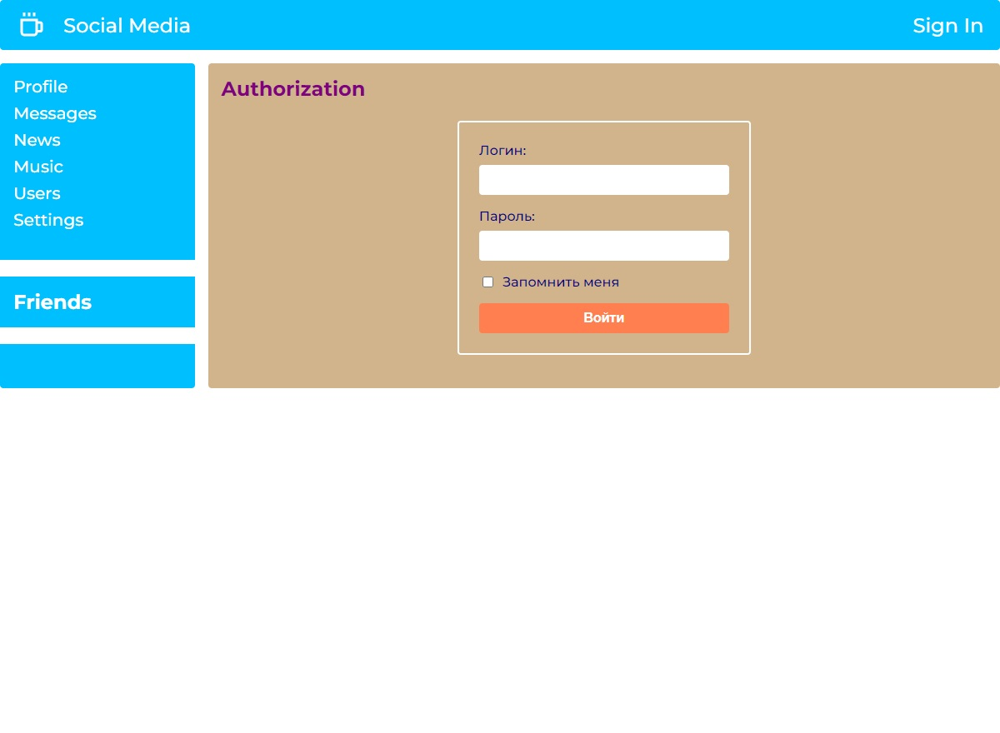

# Reactjs - The way of the samurai (ReactJS - Путь Самурая)

Учебный проект по онлайн курсу IT-KAMASUTRA ([ReactJS - Путь Самурая](https://www.youtube.com/watch?v=gb7gMluAeao&list=PLcvhF2Wqh7DNVy1OCUpG3i5lyxyBWhGZ8))

В проекте Frontend (react-itkamasutra) и Backend (react-itkamasutra-server). Используюется технологии Redux, REST API, Axios, Redux-thunk, HOC, Redux-form, Hook

 | 
---|---
 | 
